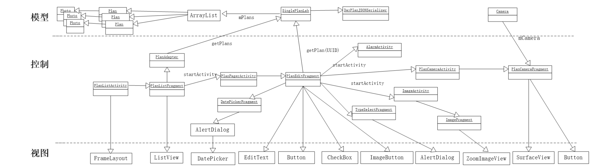

# DayPlan 时间管理APP

## 需求分析

当前，市场上有足够多的优秀日程管理应用，如Wunderlist等。这些应用大多提供日程记录、日程优先级、闹钟提醒、同步等功能。但这些应用的任务事项时间跨度都比较大、期限也比较长。这虽然有利于把握大的方向，但对于短期内效率的提高不一定有很好的效果。从另一个角度上看，养成良好的时间管理习惯，既需要着眼于长远的目标，也需要有具体的、可行的短期实践方案。所谓短期，我认为一天比较合适。

因此，DayPlan并不致力于像Wunderlist一样具有十分全面的功能，而是专注于为拖拉者做好一天（甚至更短）的规划，通过简单的提醒及时检查、纠偏，让拖拉者逐渐成长为高效的成功人士。

## 功能简介

### 规划功能

用户可以在前一天晚上做好第二天的规划，添加必要的任务事项，包括任务描述，任务的紧迫性（重要紧迫、重要不紧迫、紧迫不重要、不紧迫不重要），截止时间，并且可以添加一张相关的图片作为提示。

### 提醒功能

​	用户可以为每个事项添加提醒功能，每当截止时间到的时候，DayPlan给出一个简短的提醒。DayPlan致力于在提醒用户的同时不过分打扰用户。

### 分享功能

DayPlan可以从某个任务生成一个描述该任务的字符串，并分享到其他应用。

## 系统架构

- 模型层

- 视图层

- 控制层

  

